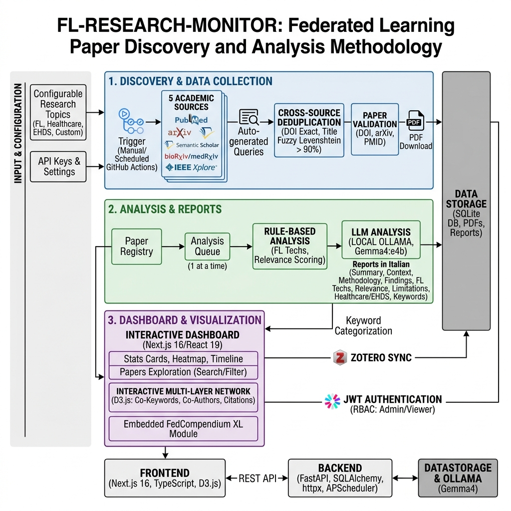
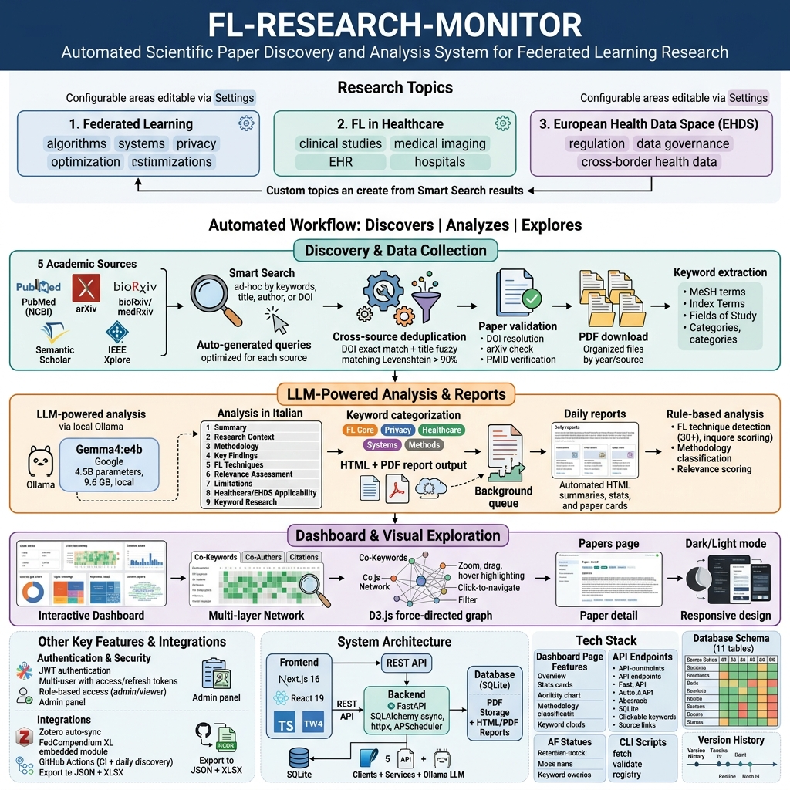

# FL-RESEARCH-MONITOR

Automated scientific paper discovery, analysis, and **structured review framework** for **Federated Learning** research, with a focus on healthcare applications and the **European Health Data Space (EHDS)**.

FL-Research-Monitor continuously queries seven major academic databases — **PubMed**, **arXiv**, **bioRxiv/medRxiv**, **Semantic Scholar**, **IEEE Xplore**, and **Elsevier (Scopus)** — to discover new publications matching configurable research topics. Discovered papers are automatically deduplicated across sources, validated via DOI/arXiv/PMID resolution, classified into research topics, and enriched with keywords from each source's metadata.

The framework provides three distinct review surfaces — **Meta Review** of LLM-generated extended abstracts, **Peer Review** of unpublished manuscripts for academic journals (with verbatim journal templates such as IEEE T-AI), and **Paper Quality Review** for versioned scientific quality assessment of published papers — each producing formal academic-grade PDF/LaTeX/Markdown/TXT reports with configurable author signature, suitable for sharing with scientific tutors.

Paper analysis runs on two complementary LLM tracks: **Gemma4:e4b** (local Ollama) for batch background analysis in Italian, and **Claude Opus 4.6** with **extended thinking** for high-stakes admin-only tasks (peer review drafting, paper quality assessment, extended abstract generation). All review surfaces support **side-by-side editing** with the source PDF, in-place editing of LLM output (with versioning), and synchronized export to four formats.

A **unified paper lifecycle** tracks manuscripts from initial submission through revision rounds to publication, with **Submission Timeline** (round-by-round deadline tracking and decision logging), **Review Journal** (structured reviewer feedback with severity, status, and response tracking), **Manuscript Bibliography** (cited papers with context tagging, keyword/label cascade filters, and TXT/BibTeX/CSV export), and **supplementary file management** (tabbed Main/Supplementary PDF viewer with per-file page counts).

The framework supports **role-based multi-user access** with three functional profiles — **admin** (full control), **tutor** (read-only with Tutor Note feedback capability), and **viewer** (read-only consultation). Tutor notes are visually highlighted in yellow with timestamps, and a **guided interactive tour** (driver.js) auto-starts on first login for tutor/viewer users, covering both the general sidebar navigation and a dedicated manuscript detail walkthrough.

An interactive **Next.js dashboard** provides real-time exploration with stats cards, activity heatmaps, timeline charts, keyword clouds, a **multi-layer citation network**, and a unified **Zotero integration** that auto-syncs both metadata and shareable analysis artifacts (Extended Abstract + validation report) without ever exposing the obviously LLM-generated working notes. **Login notifications** are sent via Gmail SMTP on every access, with a persistent **login audit log** viewable in Settings.

**The framework is deployed in production at [https://resmon.fabioliberti.com](https://resmon.fabioliberti.com)** — full Docker stack on an Aruba VPS, with Caddy reverse proxy, automatic HTTPS via Let's Encrypt, HTTP/3 (QUIC) support, hardened authentication, and dataset migrated from the local development instance.

---



**Figure 1 — System architecture and data pipeline.** The diagram illustrates the end-to-end flow from seven heterogeneous academic data sources (PubMed, arXiv, bioRxiv/medRxiv, Semantic Scholar, IEEE Xplore, Elsevier Scopus) through the ingestion layer — where papers are deduplicated via DOI exact match and title fuzzy matching (Levenshtein > 90%), validated against authoritative registries, and classified into configurable research topics — to the dual-track LLM analysis engine (local Gemma4:e4b for batch processing, cloud Claude Opus 4.6 with extended thinking for high-stakes review tasks). The generated artifacts flow through a structured Meta Review validation pipeline before reaching the tutor-facing Zotero surface, ensuring that only editorially verified Extended Abstracts are shared externally.

---



**Figure 2 — Complete feature overview.** The infographic maps the full capability set of FL Research Monitor across its principal functional domains: automated paper discovery and enrichment, four-mode LLM analysis with versioned output, three independent review surfaces (Meta Review for Extended Abstract validation, Peer Review for confidential journal manuscript evaluation, Paper Quality Review for versioned scientific grading), the unified paper lifecycle management (My Manuscripts with submission timeline tracking, Review Journal with structured reviewer feedback, and manuscript bibliography with cascade keyword/label filters), role-based multi-user access control (admin, tutor/viewer) with granular permission gating, and the production deployment architecture (Docker multi-stage builds, Caddy reverse proxy with automatic TLS, hardened VPS with rate limiting and brute-force mitigation).

---

## Table of Contents

- [Research Topics](#research-topics)
- [Three Review Surfaces](#three-review-surfaces)
- [Unified Paper Lifecycle](#unified-paper-lifecycle)
- [Role-Based Access & Guided Tour](#role-based-access--guided-tour)
- [Key Features](#key-features)
- [Architecture](#architecture)
- [Deployment Topologies](#deployment-topologies)
- [Security & Threat Model](#security--threat-model)
- [Quick Start](#quick-start)
- [Docker Deployment](#docker-deployment)
- [Environment Variables](#environment-variables)
- [Dashboard Pages](#dashboard-pages)
- [API Endpoints](#api-endpoints)
- [LLM Paper Analysis](#llm-paper-analysis)
- [Source Status](#source-status)
- [CLI Scripts](#cli-scripts)
- [Version History](#version-history)
- [Project Structure](#project-structure)
- [License](#license)

---

## Research Topics

The system monitors three configurable research areas (editable via Settings or Smart Search):

- **Federated Learning** — algorithms, systems, privacy, optimization
- **FL in Healthcare** — clinical studies, medical imaging, EHR, hospitals
- **European Health Data Space (EHDS)** — regulation, data governance, cross-border health data

Custom topics can be created from Smart Search results for targeted monitoring.

## Three Review Surfaces

The framework distinguishes three different review intents, each with its own workflow, rubric, output, and visibility rules:

### 1. Meta Review — validating LLM Extended Abstracts

The Extended Abstract is the only LLM-generated artifact actually shared with academic tutors. Before sharing it, the user runs a structured **Meta Review** to verify the synthesis is faithful, complete, and properly formatted. Each of the 9 EXT.ABS sections (Abstract → Originality) is scored 1–5 with a per-section comment, plus an overall General notes score. The reviewer can **edit any section in-place** during review: edits are persisted as a new version of the analysis (`engine=reviewer-edit`), keeping the LLM original in history for audit. The Save button automatically syncs the corrected document and the validation report to Zotero.

- Sidebar: **Meta Review** — queue of pending EXT.ABS validations, grouped by paper, sorted by paper rating
- UI: side-by-side modal — analysis HTML on the left (with optional tab to the source PDF), rubric + status + computed/reviewer scores on the right
- Status: Validate / Needs Revision / Reject (auto-suggested from reviewer score, manually overridable)
- Output on Zotero: `analysis_extended_{id}.pdf` (the corrected version) + the paper's source PDF — the formal validation report stays **strictly local** (see Zotero Integration below)

### 2. Peer Review — confidential review of unpublished manuscripts

Dedicated, completely isolated module for reviewing manuscripts that journals send you to evaluate. Confidential by design: never indexed in topics, never synced to Zotero, never mixed with the public bibliography. Stored in `data/peer-review/{id}/` with strict separation from `data/pdfs/`.

Supports a **journal-template registry**: each template defines its own dimensions (or none), recommendations, and structured extras (boolean / choice / text). The shipped templates include:

- **Generic** — six-dimension rubric with standard recommendation set
- **IEEE T-AI** — verbatim transcription of the official IEEE Transactions on Artificial Intelligence ScholarOne reviewer form: 10 categorical/boolean/text questions (verbosity, technical writing, English, accessibility, reproducibility, novelty, significance, best paper, suggested references, self-citation), 5 recommendations, no 1–5 stars

Adding a new journal template requires a single dataclass entry in `review_templates.py` — the report generators, frontend forms, and LLM assistant adapt automatically.

Features:
- Side-by-side full-page detail: manuscript PDF on the left, structured form on the right
- Private working notes (never included in any export)
- Four-format synchronized export on every save: **PDF / TEX / MD / TXT** — the TXT version is formatted for direct copy-paste into journal submission systems (ScholarOne, EditorialManager, etc.)
- **AI-assisted drafting** (admin only): one click runs Claude Opus 4.6 with extended thinking on the manuscript and produces a complete suggested review (rubric + extras + recommendation + comments to authors + confidential to editor); the suggestion is *never* persisted automatically and must be explicitly reviewed and edited before saving

### 3. Paper Quality Review — versioned scientific quality grading

Personal quality assessment of papers already in your bibliography, used to grade your sources before citing them or recommending them to a tutor. Versioned by design: when you reconsider a judgement, click "New version" to snapshot the current state into v+1 while keeping v1 in history.

- 10 dimensions: research question, literature review, methodology rigor, results validity, discussion depth, limitations, reproducibility, originality, significance, writing clarity
- 5 grades: Excellent / Good / Adequate / Weak / Unreliable (color-coded badge per paper in the papers list)
- 5 structured extras: data availability, code availability, ethics disclosure, conflict of interest, planned use in own work
- Side-by-side detail page (paper PDF + form), version history dropdown, **AI-assisted drafting** (admin only) on the same Opus 4.6 + extended thinking pattern as peer review
- Four-format export per version (`paper_quality_{id}_v{N}.{pdf,tex,md,txt}`)
- Quality filter and clickable Q badge in the papers list

## Unified Paper Lifecycle

The framework tracks the full lifecycle of user-authored manuscripts (role `my_manuscript`) and manuscripts under review for journals (role `reviewing`), from initial submission through successive revision rounds to final publication.

### My Manuscripts

Each manuscript has a dedicated detail page with a **split-pane layout**: the document viewer (left) and the management panels (right). The document viewer supports **tabbed navigation** between the main manuscript PDF and an optional **supplementary file**, each with independent upload and page-count tracking.

The **document toolbar** (admin only) provides:
- **Upload PDF** — main manuscript document
- **TEX ⬆⬇** — import/export LaTeX source file
- **MD ⬆⬇** — import/export Markdown source file
- **S ↑** — upload supplementary file
- **Overleaf** — direct link to the Overleaf project (if configured)

**Document type classification**: each manuscript carries a `paper_type` field (Extended Abstract, Full Paper, Conference Paper, Journal Article, Camera Ready, Poster, Preprint) displayed as a colored badge in the manuscript list, detail header, and paper detail page.

### Submission Timeline

Per-manuscript timeline tracking each submission round with:
- **Round label** from standardized presets (Abstract Submission, Extended Abstract, Full Paper, Revised Paper Round 1–3, Minor/Major Revision, Camera Ready, Final Submission, Poster/Presentation) or custom labels
- **Document type**, **submission date**, **deadline** with visual urgency indicator (red overdue, amber within 7 days)
- **Decision** (Pending, ✓ Accepted, ✓ Accepted w/ revisions, Minor revisions, Major revisions, Rejected) with date and notes
- **Per-round PDF upload** for versioned document management

The latest submission decision is displayed as a colored badge in the My Manuscripts list.

### Review Journal

Shared component for structured reviewer feedback, integrated in paper detail, peer review detail, and my-manuscripts detail pages. Each reviewer entry contains:
- **Observations** with severity (major/minor/suggestion/praise), status tracking (to address → addressed / rejected justified / N/A), section references, and response fields
- **Rating** (numeric with configurable scale and label)
- **Decision** (Honours / Accepted / Minor revision / Major revision / Rejected)
- **Evaluation rubric** with 8 default dimensions scored 1–5
- **File attachments** (annotated PDFs, editorial letters)
- **Edit lock** (admin): rating, decision, rubric, and observation status require explicit Edit/Done toggle to prevent accidental modifications

### Manuscript Bibliography

Per-manuscript citation list linking to papers in the main bibliography, with:
- **Search and add** references from the paper database
- **Import from label** with preview, rating filter, and select-all
- **Context tagging** per reference (Introduction, Related Work, Methodology, Comparison, Results, Discussion)
- **Keyword aggregate** with collapsible tag cloud and multi-select filter
- **Label aggregate** with color badges and interdependent filter counts (keywords ↔ labels cascade)
- **Export** in TXT (numbered list), BibTeX, and CSV formats

## Role-Based Access & Guided Tour

### User Roles

| Capability | Admin | Tutor/Viewer |
|-----------|-------|-------------|
| Discovery, Topics, LLM analysis | Full access | Read-only |
| Paper labels, notes, rating, TutorCheck | Full access | Hidden |
| Peer Review, Quality Review, Meta Review | Full edit + AI suggest | Read-only (form disabled) |
| My Manuscripts — upload, timeline, bibliography | Full edit | Read-only |
| Review Journal — tutor notes | Full edit all entries | Add/edit/delete own `tutor_feedback` entries only |
| Zotero sync | Full access | Hidden |
| Settings — topics, users, API keys | Full access | Change own password only |
| Reports — generate | Full access | View only |
| Disable/Enrich paper | Full access | Hidden |

### Tutor Notes

Tutor/viewer users can leave feedback directly in the Review Journal via the **"+ Add Tutor Note"** button. Tutor notes are:
- Visually highlighted with a **yellow border and amber TUTOR badge**
- Timestamped with creation date/time
- Editable only by the tutor who created them (text, severity, observations)
- Visible to all users in the Review Journal

### Guided Interactive Tour

An interactive step-by-step overlay tour (powered by `driver.js`) guides new tutor/viewer users through the application:

1. **General Tour** (12 steps) — auto-starts on first login at the Dashboard, covers all sidebar sections with descriptions
2. **Manuscript Tour** (8 steps) — auto-starts on first visit to a My Manuscripts detail page, covers the document toolbar, PDF viewer, Submission Timeline, Review Journal, tutor note workflow, and bibliography

Tours are stored per-user in `localStorage` and do not repeat after completion. All users can manually restart tours from the **About → Guided Tour** section.

### Login Notifications & Audit Log

- **Email notification** sent to the admin on every successful login (Gmail SMTP, non-blocking)
- **Persistent login log** in the database, viewable in Settings → Login Log (admin only)
- **Export** in TXT and CSV formats, with configurable history depth (Last 50 / 100 / 500 / All)

### Password Security

- Minimum 12, maximum 20 characters enforced at API level (Pydantic validation)
- **Real-time strength indicator** with 6 criteria: uppercase, lowercase, number, special character, minimum length, no username inclusion
- **Show/hide toggle** (eye icon) on all password fields
- Admin can **reset any user's password** via inline form with strength validation

### Sidebar NEW Badges

Pulsing red dots appear on Meta Review, Peer Review, My Manuscripts, and Quality Review sidebar entries when new content has been added since the user's last visit to that section. The badge disappears when the user enters the section, tracked per-user via `localStorage`.

## Key Features

### Discovery & Data Collection
- **7 Academic Sources**: PubMed (NCBI), arXiv, bioRxiv, medRxiv, Semantic Scholar, IEEE Xplore, Elsevier (Scopus)
- **Smart Search**: ad-hoc search by keywords, title, author, or DOI across all sources
- **Auto-generated queries**: optimized per source from user keywords
- **Cross-source deduplication**: DOI exact match + title fuzzy matching (Levenshtein > 90%)
- **Paper validation**: DOI resolution, arXiv check, PMID verification
- **Import by DOI**: single-click import from any source by DOI
- **PDF download**: organized by year/source in `data/pdfs/`
- **Keyword extraction**: MeSH (PubMed), Index Terms (IEEE), Fields of Study (S2), categories (arXiv), Scopus subject areas
- **PDF keyword extractor v2**: two-strategy regex parser handling single-line / block / spaced-out (`K E Y W O R D S` Wiley-style) / hyphen-broken patterns, with dehyphenation pre-pass and author-name false-positive filter

### Analysis & Reports
- **Dual LLM track**:
  - **Gemma4:e4b** (Ollama, local) for background batch analysis in Italian
  - **Claude Opus 4.6** with extended thinking for high-stakes tasks (Extended Abstract generation, AI-suggest peer review, AI-suggest paper quality assessment)
- **Four analysis modes** per paper: `quick` / `summary` / `extended` / `deep` — with mode-rank logic that prevents accidentally degrading the structured analysis
- **Extended Abstract** — sober single-column 2-page LaTeX output suitable for academic sharing with tutors
- **Versioned analysis**: every reviewer in-place edit creates a new version of the analysis, with full history, diff vs previous version (semantic diff via Haiku LLM), and automatic Zotero re-sync
- **Sober unified LaTeX template**: lmodern, scshape sections, microtype, single column, no decorations, no colors — academic publication standard
- **Configurable PDF signature** (Settings → PDF Author Signature): footer becomes *"Reviewed by [your name] — [your affiliation] · Generated by FL Research Monitor"* on all generated PDFs (analysis, validation, peer review, paper quality)
- **Validation report** (`validation_{paper_id}.pdf`) — formal scientific document with per-section rubric table, computed and reviewer scores, dynamically regenerated and cached on every change, kept strictly local
- **Citation network**: ego-centric graph from Semantic Scholar, with batch import of cited/citing papers, CSV export, min-citations filter, cached via `citation_links` table
- **Citation refresh**: batch via S2 batch API (500 paper/request, rate limited), scheduled daily at 07:00 UTC after discovery, plus manual per-paper and batch refresh buttons
- **Daily reports**: automated HTML summaries with stats and paper cards
- **Cost tracking**: per-call token usage and USD cost logged for every Claude API request, with API costs section in Settings

### Tutor Check & Quality Gating
- **Tutor Check**: explicit three-state decision per paper (OK / Review / NO) reflecting the user's final judgement after analysis, surfaced as:
  - Color-coded tags on Zotero (✅ Check OK, ⚠️ Check Review, ❌ Check NO) with matching short forms for Zotero colored tags 1–9
  - Star rating on Zotero (from the native rating field) so tutors see an immediate priority signal
  - Clickable **T** badge per row in the papers list
  - Dedicated filter in the papers list
- **Label normalization**: case-insensitive deduplication of labels with Unicode NFKC normalization, en-dash/em-dash flattening, non-breaking space collapsing — prevents duplicate labels from typography variants

### Dashboard & Visualization
- **Interactive Dashboard**: stats cards, **validation progress card** (validated / needs revision / rejected / pending / avg score / this week), activity heatmap, timeline chart, source pie chart, topic treemap, keyword cloud, recent papers
- **Multi-layer Network**: Co-Keywords | Co-Authors | Citations tabs with D3.js force-directed graph
- **Citation network explorer**: paper search, ego-centric graph, references vs citations, min-citations filter, batch import of external nodes, CSV export, cached `citation_links` table
- **Papers page**: full-text search, **14+ filters** for topic / source / keyword / label / FL technique / dataset / method tag / **validation status** / **quality grade** / **tutor check** / rating / PDF / Zotero / disabled, plus an 8-option sort selector (newest/oldest added, publication date, citations, title A–Z / Z–A)
- **Per-row badges**: color-coded **T** (tutor check), **R** (review), **Q** (quality) circular badges for every paper, clickable
- **Paper detail**: full metadata, authors with ORCID, abstract, keywords (clickable), source-specific links, label management, rating, notes, **Sync to Zotero**, **Quality Review** action button, **Tutor Check widget**
- **Comparison page**: structured side-by-side comparison of multiple papers across 13 fields, Research Gaps aggregation tab, saved comparisons repository in localStorage with rename/delete, Excel export via SheetJS
- **Validation Queue page** (Meta Review): groups all pending/needs-revision EXT.ABS reviews by paper with mode pills sorted extended → summary → quick → deep, paper labels visible per row
- **Sidebar tooltips**: every navigation item has a delayed-show tooltip with a one-sentence description
- **Dark/Light mode** with smooth transitions, **responsive design** for mobile access

### Zotero Integration (tutor-facing surface)
- **Auto-sync** of selected papers to a Zotero collection (Web API v3) with label → sub-collection mapping
- **Atomic sync flow**: a single Save button (in the Meta Review modal or on the paper detail page) creates the Zotero item if missing, updates metadata + tags + Extra field, and uploads attachments — all in one action
- **Shareable filter**: only the **Extended Abstract** and the **paper's source PDF** are uploaded as attachments. Quick, Deep and Summary analyses are working notes that stay strictly local — they are too obviously LLM-generated to share with tutors, and only the EXT.ABS goes through the rigorous Meta Review workflow before being released
- **Validation report stays LOCAL**: `validation_{id}.pdf` is generated and stored on disk only — it is **not** uploaded to Zotero. The validation report is part of the internal scientific review audit trail and is not part of the tutor-facing surface. The Zotero Extra field still receives the validation summary (status, validated modes) as text so tutors can see at a glance whether the analysis has been reviewed
- **Emoji-prefixed tags** visible in the Zotero Tags column:
  - Validation: ✅ Validated · extended, 🟡 Partially Validated, ⚠️ Revision · extended, ❌ Rejected · extended, 🕒 Pending Review
  - Tutor Check: ✅ Check OK, ⚠️ Check Review, ❌ Check NO
  - Plus short tag forms (`validated-extended`, `check-ok`, …) so the user can configure Zotero colored tags 1–9
- **Extra field** populated with rating + validation summary + tutor check status
- **Deep links**: `zotero://select/library/items/{key}` and web view buttons on every paper detail
- **Cleanup script**: `cleanup_zotero_quick_deep.py` removes legacy quick/deep PDFs from past syncs and resets stale `zotero_synced` flags in DB
- **Collection-duplication fix**: `get_or_create_collection` uses targeted `/collections/top` and `/collections/{key}/collections` endpoints with pagination instead of the global `/collections` listing — prevents the recurring duplication bug when label sub-collections grow
- **Merge script** for cleaning up any pre-existing duplicate parent collections
- **Disabled papers auto-removal**: papers toggled to disabled are automatically removed from Zotero on next sync

### Authentication & Security
- **JWT authentication**: multi-user with access tokens (24h) + refresh tokens (7 days), bcrypt password hashing
- **Role-based access**: admin (full access), tutor/viewer (read-only with tutor note capability); comprehensive frontend permission gating with `fieldset disabled` on review forms
- **Admin-only LLM features**: AI-assisted peer review and AI-assisted paper quality assessment using Claude Opus 4.6 with extended thinking are protected by `require_admin` and hidden from non-admin UIs
- **Admin panel**: user management (create, edit role, enable/disable, **reset password**, **delete user**), login log with export
- **Login audit**: every successful login is logged to `login_log` table (user, IP, user-agent, timestamp) and triggers an email notification to the admin via Gmail SMTP
- **Password strength**: real-time 6-criteria validation (uppercase, lowercase, number, special char, min length, no username) with visual strength bar
- **Auto-seed**: default admin user created on first startup from `.env`
- **Password validation** (production): Pydantic `Field(min_length=12, max_length=20)` enforced on both `CreateUserRequest` and `ChangePasswordRequest` — validated at API boundary, bypassed only by the bootstrap seed so the local dev env can still use short passwords
- **Rate limiting**: SlowAPI per-IP throttle of **5 login attempts per minute** on `POST /auth/login`, with 429 Too Many Requests on overflow — mitigates brute force attacks
- **Protected routes**: all API endpoints require authentication
- **Confidential storage**: peer review manuscripts stored under `data/peer-review/{id}/`, never indexed, never synced

### Other Integrations
- **FedCompendium XL**: embedded educational module with curated learning paths
- **GitHub Actions**: CI pipeline + daily scheduled discovery
- **Export**: JSON + XLSX multi-sheet workbook

## Architecture

```
Frontend (Next.js 16 + React 19 + TypeScript + Tailwind CSS 4)
    ↓ REST API /api/v1/* (proxied via next.config.ts / Caddy in production)
Backend (FastAPI + SQLAlchemy async + httpx + APScheduler + Anthropic SDK + SlowAPI)
    ↓ 7 academic API clients + dual LLM (Ollama Gemma4 + Claude Opus 4.6)
Database (SQLite) + PDF Storage + HTML/LaTeX/MD/TXT/PDF Reports
    ↓
Ollama (Gemma4:e4b) — local LLM for batch analysis in Italian
Anthropic API (claude-opus-4-6) — extended-thinking for high-stakes reviews
```

### Tech Stack

| Layer | Technology |
|-------|-----------|
| Frontend | Next.js 16.2, React 19, TypeScript 6, Tailwind CSS 4, Recharts, D3.js 7, SWR |
| Backend | FastAPI, SQLAlchemy async, httpx, APScheduler, Jinja2, bcrypt, python-jose, anthropic SDK, PyMuPDF (fitz), python-markdown, SlowAPI |
| Database | SQLite (aiosqlite) |
| LLM (local) | Ollama + Gemma4:e4b (9.6 GB) |
| LLM (cloud) | Anthropic Claude Opus 4.6 with extended thinking + Claude Haiku 4.5 (structured extraction & diff summaries) |
| PDF | pdflatex (TeX Live, with `tabularx`, `lmodern`, `microtype`, `titlesec`) — fallback to weasyprint |
| Math rendering | MathJax 3 (HTML), native LaTeX (PDF) |
| Containerization | Docker multi-stage builds (Python 3.12-slim-bookworm + Node 22-alpine) |
| Reverse proxy | Caddy 2 (automatic HTTPS via Let's Encrypt, HTTP/2, HTTP/3 QUIC) |
| CI/CD | GitHub Actions |

### Database Schema (key tables)

```
papers → paper_authors → authors
papers → paper_sources
papers → paper_topics → topics
papers → paper_labels → labels
papers → paper_notes
papers → synthetic_analyses
papers → analysis_queue          ← validation, rubric, scores, versioning
papers → structured_analyses     ← Haiku-extracted FL techniques, datasets, method tags
papers → citation_links          ← cached S2 citation network
papers → paper_quality_reviews   ← versioned quality assessment
papers → reviewer_entries        ← Review Journal observations + rubric + rating
papers → submission_rounds       ← timeline round tracking with deadlines + decisions
papers → paper_references        ← manuscript bibliography links
peer_reviews                     ← isolated peer review module
app_settings                     ← runtime config (PDF signature, ...)
fetch_logs
daily_reports
smart_search_jobs
users
login_log                        ← access audit trail (user, IP, user-agent, timestamp)
```

Note: the `papers` table carries a `tutor_check` column (nullable `'ok' | 'review' | 'no'`) used by the Tutor Check workflow.

## Deployment Topologies

FL-Research-Monitor supports **three coexisting deployment topologies**, each serving a different purpose in the scientific review lifecycle:

### 1. Native Development (local, daily work)
- **Backend**: `uvicorn app.main:app --reload --port 8000` from the `fl-research-monitor` conda environment
- **Frontend**: `npm run dev` on `localhost:3000` with Next.js proxy to `localhost:8000/api/*`
- **Data**: `backend/data/` — the user's canonical SQLite DB, PDFs, and generated reports
- **Use**: daily editing, LLM analysis with Claude Opus, interactive Meta Review, testing changes before committing

### 2. Docker Local Stack (regression testing)
- **Entry point**: `docker compose up` on `localhost:8080` via a Caddy reverse proxy
- **Data**: `data-docker/` — isolated copy of `backend/data/`, never writes to the canonical directory
- **Rationale**: allows the Docker stack to run in parallel with the native dev stack without risk of concurrent writes to the same SQLite file. Used to validate Docker builds and configuration changes before deploying to production
- **Use**: `docker compose up -d` + test on `localhost:8080`, then `docker compose down` when finished

### 3. Production (Aruba VPS, 24/7)
- **URL**: [https://resmon.fabioliberti.com](https://resmon.fabioliberti.com)
- **Infrastructure**: Aruba Cloud VPS O8A16 (8 vCPU, 16 GB RAM, 160 GB SSD), Ubuntu 24.04 LTS, hardened SSH with key-only auth + fail2ban + UFW
- **Entry point**: Caddy on ports 80 / 443 (TCP + UDP for HTTP/3), automatic TLS via Let's Encrypt with HSTS one-year policy
- **Data**: `/opt/reserch_mon/data/` — independent database, bootstrapped by rsync from the local dev instance
- **Runtime**: `docker-compose.production.yml` with `APP_ENV=production` (APScheduler active: daily discovery 06:00 UTC, citation refresh 07:00 UTC), dedicated `.env.production` with strong secrets that lives **only on the VPS** (mode `600`, owner `fabio`, never committed)
- **Use**: 24/7 shared instance accessible from any device (desktop, mobile), for consultation of the bibliography and triggering scheduled discovery in the background

All three topologies run from the same git branch (`main`) — the distinction is configuration (env files, ports, Caddy config), not code.

## Security & Threat Model

### Assets protected
1. **User accounts** (admin and viewer roles) — the admin role controls LLM-assisted features, user creation, and data modification
2. **Paper bibliography, reviews, and analyses** — the outcome of the user's research work
3. **Third-party API keys** (Claude, Zotero, Semantic Scholar, IEEE, Elsevier) — financial and reputational impact if exposed
4. **Confidential peer review manuscripts** — legally confidential material delivered under journal embargo, stored in isolated `data/peer-review/` directory

### Attack surface (production topology)
- Public HTTPS endpoint `resmon.fabioliberti.com:443` (TLS 1.3 via Caddy)
- SSH admin access on port 22 (key-only, root disabled, fail2ban)
- No other ports exposed (UFW default deny)

### Controls in place
| Control | Implementation |
|---|---|
| **Transport security** | TLS 1.3 mandatory, HSTS `max-age=31536000; includeSubDomains` (1 year), HTTP/2 + HTTP/3 (QUIC) |
| **Certificate management** | Automatic Let's Encrypt via Caddy, TLS-ALPN-01 challenge, automatic renewal |
| **Browser hardening headers** | `X-Frame-Options: DENY`, `X-Content-Type-Options: nosniff`, `Referrer-Policy: strict-origin-when-cross-origin`, `Server` header removed |
| **Authentication** | JWT access tokens (24h) + refresh tokens (7 days), bcrypt-hashed passwords |
| **Password strength (API)** | Pydantic validation `min_length=12, max_length=20` enforced on `CreateUserRequest` and `ChangePasswordRequest` |
| **Brute-force mitigation** | SlowAPI per-IP rate limit: **5 logins / minute**, HTTP 429 on overflow |
| **Authorization** | Role-based access (admin / viewer), `require_admin` decorator on sensitive endpoints (user CRUD, LLM-assisted features, topic modification) |
| **Secrets management** | `.env.production` lives only on VPS with mode `600`, never committed to git; rotated via manual edit + container restart |
| **Network filtering** | UFW firewall: deny incoming by default, allow only SSH + 80 + 443 |
| **Intrusion prevention** | fail2ban with sshd jail, active bans logged |
| **Patch management** | `unattended-upgrades` enabled for automatic security patches |
| **Confidentiality** | Peer review manuscripts isolated in `data/peer-review/{id}/`, never indexed, never synced to Zotero |
| **Data at rest** | SQLite file on disk with filesystem-level permissions; encryption at rest delegated to VPS storage layer |
| **Audit trail** | Caddy JSON access log (stdout, captured by `docker logs`), backend application logs with timestamped events, **login_log** table with user/IP/user-agent/timestamp (viewable in Settings, exportable as TXT/CSV) |
| **Login notifications** | Gmail SMTP email sent to admin on every successful login (non-blocking background thread) |
| **Password strength** | Real-time 6-criteria validation (uppercase, lowercase, digit, special char, min length 12, no username) with visual strength bar on all password forms |

### Known limitations (tracked for future hardening)
- SSH on port 22 (default) — brute force reduced by fail2ban but not eliminated; tracked as future enhancement
- No automated backup to external storage — planned in Phase 11 (tar + gpg + Backblaze B2)
- No external uptime monitoring — planned in Phase 11 (UptimeRobot + Healthchecks.io)
- Base image `python:3.12-slim-bookworm` has 3 "high" CVEs at build time (common Debian base issues, not exploit-reachable in this app) — tracked for periodic rebuild and eventual upgrade to `trixie`

## Quick Start

### Prerequisites

- **Python 3.11+** (recommended: conda environment `fl-research-monitor`)
- **Node.js 22+**
- **Ollama** (optional, for local Gemma4 background analysis)
- **TeX Live** with `tabularx` package (for PDF generation via pdflatex)
- **Docker Desktop** (optional, only for Docker-based deployment)

### 1. Backend Setup

```bash
cd backend
conda activate fl-research-monitor
pip install -r requirements.txt
cp ../.env.example .env   # Edit with your settings
uvicorn app.main:app --reload --port 8000
```

### 2. Frontend Setup

```bash
cd frontend
npm install
npm run dev   # http://localhost:3000
```

### 3. Login

Open `http://localhost:3000` — you'll be redirected to the login page.
Use the credentials configured in your `.env` file (`ADMIN_USERNAME` / `ADMIN_PASSWORD`).
Change password after first login via Settings → Change Password (12–20 characters required in production builds).

### 4. First Discovery & Configuration

- Go to **Discovery** and click **Run Discovery (All)** to fetch papers
- Go to **Settings → PDF Author Signature** and set your name and affiliation (will be used as footer of all generated PDFs)

## Docker Deployment

### Local Docker stack (optional, for regression testing)

```bash
# Copy template and fill in API keys
cp .env.docker.example .env.docker
$EDITOR .env.docker

# Copy runtime data to the isolated volume (first time only)
cp -R backend/data/ data-docker/

# Build and start the full stack (~20-40 min first build for TeX Live)
docker compose up -d --build

# Visit http://localhost:8080 in your browser
# Stop the stack (keeps data-docker/)
docker compose down
```

The local Docker stack is completely isolated from the native dev environment:
- Uses `data-docker/` instead of `backend/data/` — your canonical DB is never touched
- Exposes only Caddy on port 8080 — does not collide with native dev on 3000 + 8000
- Can run in parallel with the native stack for A/B comparison

### Production deployment (Aruba VPS)

The production deployment is documented in detail in `DEPLOYMENT_OPERATIVE_DOCKER.md` (local-only, gitignored). The short summary:

```bash
# On the VPS (accessed via SSH alias `resmon`)
cd /opt/reserch_mon
git pull                                                  # pull latest
docker compose -f docker-compose.production.yml up -d --build
docker compose -f docker-compose.production.yml logs -f backend
```

Key production differences vs. local Docker:
- `docker-compose.production.yml` binds to host ports **80, 443/tcp, 443/udp** (HTTP + HTTPS + HTTP/3)
- `Caddyfile.production` configures the real domain (`resmon.fabioliberti.com`) with automatic Let's Encrypt
- `.env.production` (mode 600, not committed) contains production-grade `JWT_SECRET_KEY`, strong `ADMIN_PASSWORD`, `API_SERVICE_KEY`
- `APP_ENV=production` activates APScheduler (daily discovery 06:00 UTC, citation refresh 07:00 UTC)
- Bind-mount is `./data:/app/data` on the VPS (canonical production directory)

## Environment Variables

The framework uses **three separate env files** corresponding to the three deployment topologies:

- `backend/.env` — native development (short passwords OK, dev-grade JWT secret, scheduler disabled)
- `.env.docker` — local Docker stack (isolated, same credentials as dev)
- `.env.production` — VPS production (strong 20-char admin password, fresh 48-byte JWT secret, `APP_ENV=production` enables the scheduler, `CORS_ORIGINS=https://resmon.fabioliberti.com`). This file is **never committed** and lives only on the VPS at `/opt/reserch_mon/.env.production` with permissions `600`.

All three share the same variable names:

```bash
# Authentication
JWT_SECRET_KEY=your-random-secret-key
ADMIN_USERNAME=admin
ADMIN_PASSWORD=changeme                 # 12-20 chars in production
ADMIN_EMAIL=admin@localhost
API_SERVICE_KEY=                        # For GitHub Actions unattended access

# Database
DATABASE_URL=sqlite+aiosqlite:///./data/db/research_monitor.db

# Academic source API keys (optional but recommended)
NCBI_API_KEY=                           # PubMed — higher rate limits
SEMANTIC_SCHOLAR_API_KEY=               # Semantic Scholar — required for search
IEEE_API_KEY=                           # IEEE Xplore — required for IEEE search
ELSEVIER_API_KEY=                       # Elsevier (Scopus) — required for Elsevier search

# LLM
ANTHROPIC_API_KEY=                      # Claude Opus 4.6 / Haiku 4.5 — required for
                                        # Extended Abstract, AI-suggest peer review,
                                        # AI-suggest paper quality, diff LLM summaries

# Zotero integration
ZOTERO_API_KEY=                         # Web API v3
ZOTERO_USER_ID=                         # Your numeric user ID

# App
APP_ENV=development                     # 'production' enables scheduler
LOG_LEVEL=INFO
CORS_ORIGINS=http://localhost:3000,http://localhost:3001

# Storage
PDF_STORAGE_PATH=./data/pdfs
REGISTRY_PATH=./data/registry
REPORTS_PATH=./data/reports
```

Generate strong production secrets with:

```bash
openssl rand -base64 48 | tr -d "\n/=+"                    # JWT_SECRET_KEY
openssl rand -base64 30 | tr -d "\n/=+" | head -c 20       # ADMIN_PASSWORD (20 chars)
openssl rand -base64 32 | tr -d "\n/=+"                    # API_SERVICE_KEY
```

## Dashboard Pages

| Page | Features |
|------|----------|
| **Dashboard** | Stats cards, validation progress card, activity heatmap, timeline chart, source pie chart, topic treemap, keyword cloud, recent papers, export buttons |
| **Discovery** | Smart Search (keywords/title/author/DOI), source checkboxes, Recent Searches queue, source health cards, fetch trigger, fetch history, recent papers per source, import-by-DOI |
| **Topics** | Topic cards with paper counts and progress bars, filtered paper list, keywords preview, source queries |
| **Papers** | Full-text search, 14+ filters (topic / source / keyword / label / FL technique / dataset / method tag / validation / quality / tutor check / rating / PDF / Zotero / disabled), checkbox selection for batch analysis, 8-option sort selector, sortable table, pagination, T + R + Q badges per row |
| **Paper Detail** | Authors with ORCID, abstract, clickable keywords, label management, rating, notes, Tutor Check widget, Sync to Zotero, Open in Zotero (desktop+web), Quality Review action, Analysis History with version diff, Review modal, Generate analysis (4 modes) |
| **Meta Review** | Validation queue grouped by paper, EXT.ABS only, sorted by rating, mode pills sorted extended → summary → quick → deep, paper labels per row |
| **Peer Review** | List + creation form (template selector + metadata + PDF upload), detail page (side-by-side PDF + form), versioned via implicit save, AI Suggest (admin), TXT/MD/TEX/PDF download |
| **Quality Review** | List of all current quality assessments grouped by grade, detail page (side-by-side PDF + form), version history dropdown, AI Suggest (admin), New version button |
| **Network** | Multi-layer graph (Co-Keywords/Co-Authors/Citations), citation tab with paper search, ego-centric graph, references/citations toggle, min-citations filter, batch import, CSV export |
| **Comparison** | Side-by-side comparison of multiple papers across 13 structured fields, Research Gaps aggregation tab, saved comparisons in localStorage, Excel export |
| **Compendium** | Embedded FedCompendium XL (React app) with educational content and learning paths |
| **Reports** | Daily/Analysis tabs, inline HTML viewer, PDF download, report generation, analysis queue status |
| **My Manuscripts** | Manuscript list with document type + submission status badges, creation form, detail page with split-pane (Main/Supplementary PDF tabs + Timeline + Review Journal + Bibliography) |
| **Settings** | Topic CRUD (admin), **user management** (admin: create/delete/reset password/role change with strength validation), change password (all), login log with TXT/CSV export (admin), API costs (admin), **PDF Author Signature** (admin), system info |
| **About** | Project information, tech stack, **Guided Tour** restart buttons (General + Manuscript) |

## API Endpoints

### Authentication
| Method | Path | Description |
|--------|------|-------------|
| POST | `/api/v1/auth/login` | JWT login (rate limited: 5/min per IP) |
| POST | `/api/v1/auth/refresh` | Refresh access token |
| GET | `/api/v1/auth/me` | Current user profile |
| PUT | `/api/v1/auth/me/password` | Change own password (validation: 12–20 chars) |
| GET | `/api/v1/auth/users` | List users (admin) |
| POST | `/api/v1/auth/users` | Create user (admin, password 12–20 chars) |
| PUT | `/api/v1/auth/users/{id}` | Update user role/status (admin) |
| PUT | `/api/v1/auth/users/{id}/reset-password` | Admin resets a user's password |
| DELETE | `/api/v1/auth/users/{id}` | Delete user permanently (admin) |
| GET | `/api/v1/auth/login-log` | Login audit log (admin, paginated) |

### Papers, Analytics & App Settings
| Method | Path | Description |
|--------|------|-------------|
| GET | `/api/v1/papers` | List papers (paginated, 14+ filters including validation, quality, tutor_check, label, fl_technique, dataset, method_tag) |
| GET | `/api/v1/papers/{id}` | Paper detail |
| POST | `/api/v1/papers/import-by-doi` | Import by DOI from any source |
| POST | `/api/v1/papers/{id}/rate` | Rate paper 1–5 |
| POST | `/api/v1/papers/{id}/tutor-check` | Set tutor check decision (`ok` / `review` / `no` / null) |
| GET | `/api/v1/papers/{id}/pdf-file` | Stream the local PDF (auth required) |
| GET | `/api/v1/papers/{id}/tex-file` | Download .tex source file |
| GET | `/api/v1/papers/{id}/md-file` | Download .md source file |
| GET | `/api/v1/papers/{id}/supplementary-file` | Download supplementary file |
| POST | `/api/v1/papers/{id}/upload-supplementary` | Upload supplementary file |
| POST | `/api/v1/papers/{id}/extract-pdf-keywords` | Extract keywords from local PDF |
| GET | `/api/v1/papers/manuscript-status` | Latest submission round decision per manuscript |
| GET | `/api/v1/papers/section-latest` | Latest timestamps per section (badge system) |
| GET | `/api/v1/analytics/overview` | Dashboard KPIs |
| GET | `/api/v1/analytics/timeline` | Discovery timeline data |
| GET | `/api/v1/analytics/heatmap` | GitHub-style activity heatmap |
| GET | `/api/v1/app-settings` | Read all app settings |
| PUT | `/api/v1/app-settings` | Update an app setting (admin) |

### Discovery & Smart Search
| Method | Path | Description |
|--------|------|-------------|
| POST | `/api/v1/discovery/trigger` | Start topic-based discovery (admin) |
| GET | `/api/v1/discovery/status` | Discovery running status |
| POST | `/api/v1/smart-search/search` | Smart Search by keywords/title/author/DOI |
| GET | `/api/v1/smart-search/status/{id}` | Search job status and results |
| GET | `/api/v1/smart-search/recent` | Recent search history |
| POST | `/api/v1/smart-search/save` | Save selected results to DB |
| POST | `/api/v1/smart-search/save-as-topic` | Create topic from search keywords |

### Analysis (LLM) & Meta Review
| Method | Path | Description |
|--------|------|-------------|
| POST | `/api/v1/analysis/trigger` | Queue papers for LLM analysis |
| GET | `/api/v1/analysis/{paper_id}/history` | All analysis versions for a paper |
| GET | `/api/v1/analysis/{paper_id}/html` | Inline HTML view |
| GET | `/api/v1/analysis/{paper_id}/pdf` | PDF download |
| GET | `/api/v1/analysis/{paper_id}/md` | Markdown download |
| GET | `/api/v1/analysis/{paper_id}/tex` | LaTeX source download |
| GET | `/api/v1/analysis/{paper_id}/validation-report` | Generate (cached) the formal validation report PDF |
| GET | `/api/v1/analysis/{paper_id}/diff?queue_id=X` | Section-by-section diff vs previous version |
| POST | `/api/v1/analysis/diff/llm-summary` | Haiku-summarized semantic diff |
| POST | `/api/v1/analysis/queue/{queue_id}/validate` | Save validation review (status + score + rubric + notes) |
| GET | `/api/v1/analysis/queue/{queue_id}/rubric-template` | Get rubric template (existing or blank) |
| POST | `/api/v1/analysis/queue/{queue_id}/fork` | Create new analysis version from reviewer in-place edits |
| GET | `/api/v1/analysis/review-queue` | Queue of pending/needs-revision EXT.ABS reviews |
| GET | `/api/v1/analysis/validation-stats` | Aggregate stats for the dashboard card |

### Peer Review (isolated module)
| Method | Path | Description |
|--------|------|-------------|
| GET | `/api/v1/peer-review` | List all peer reviews |
| POST | `/api/v1/peer-review` | Create new peer review |
| GET | `/api/v1/peer-review/{id}` | Detail |
| PUT | `/api/v1/peer-review/{id}` | Update (regenerates all 4 artifacts on save) |
| DELETE | `/api/v1/peer-review/{id}` | Delete |
| POST | `/api/v1/peer-review/{id}/upload-pdf` | Upload manuscript PDF |
| GET | `/api/v1/peer-review/{id}/pdf` | Stream the manuscript PDF |
| GET | `/api/v1/peer-review/{id}/review-pdf` | Generated review report (PDF) |
| GET | `/api/v1/peer-review/{id}/review-tex` | Generated review report (LaTeX) |
| GET | `/api/v1/peer-review/{id}/review-md` | Generated review report (Markdown) |
| GET | `/api/v1/peer-review/{id}/review-txt` | Plain-text review (for ScholarOne paste) |
| POST | `/api/v1/peer-review/{id}/llm-suggest` | **Admin only** — Claude Opus 4.6 extended thinking |
| GET | `/api/v1/peer-review/templates` | List available journal templates |
| GET | `/api/v1/peer-review/rubric-template?template_id=…` | Blank rubric for a template |

### Paper Quality Review (versioned)
| Method | Path | Description |
|--------|------|-------------|
| GET | `/api/v1/paper-quality` | List all current quality reviews |
| GET | `/api/v1/paper-quality/{paper_id}` | Current version (404 if none) |
| GET | `/api/v1/paper-quality/{paper_id}/history` | All versions newest-first |
| GET | `/api/v1/paper-quality/{paper_id}/v/{version}` | Specific version |
| POST | `/api/v1/paper-quality/{paper_id}` | Idempotent: create v1 or return existing |
| PUT | `/api/v1/paper-quality/{paper_id}` | Update current in place |
| POST | `/api/v1/paper-quality/{paper_id}/new-version` | Fork current → v+1 |
| DELETE | `/api/v1/paper-quality/{paper_id}/v/{version}` | Delete version |
| GET | `/api/v1/paper-quality/{paper_id}/v/{version}/{fmt}` | Download pdf/tex/md/txt |
| POST | `/api/v1/paper-quality/{paper_id}/llm-suggest` | **Admin only** — Claude Opus 4.6 extended thinking |

### Network, Reports, Zotero & Other
| Method | Path | Description |
|--------|------|-------------|
| GET | `/api/v1/network/co-keywords` | Co-keyword graph |
| GET | `/api/v1/network/co-authors` | Co-author graph |
| GET | `/api/v1/network/citations` | Cached citation network |
| POST | `/api/v1/network/refresh-citations/{paper_id}` | Refresh citations for a paper from S2 |
| POST | `/api/v1/zotero/sync` | Sync papers (idempotent: creates if missing, updates if existing) |
| POST | `/api/v1/zotero/sync-analysis/{paper_id}` | Upload analysis attachments (Extended Abstract + paper PDF) |
| DELETE | `/api/v1/zotero/remove/{paper_id}` | Remove from Zotero |
| GET | `/api/v1/topics` | List topics |
| POST | `/api/v1/topics` | Create topic (admin) |
| GET | `/api/v1/labels` | List labels (case-insensitive deduplicated) |
| GET | `/api/v1/sources` | Source health and stats |
| GET | `/api/v1/exports/json` | Download JSON registry |
| GET | `/api/v1/exports/xlsx` | Download XLSX workbook |
| GET | `/api/v1/reports` | List daily reports |
| GET | `/health` | Liveness probe (unauthenticated, returns `{"status":"ok","version":"..."}`) |

## LLM Paper Analysis

The system uses **two complementary LLM tracks**:

### Local — Gemma4:e4b via Ollama
For background batch analysis in Italian. No API costs, runs on the user's machine.

```bash
# Install/update Ollama from https://ollama.com/download
ollama pull gemma4:e4b    # 9.6 GB download
```

Note: Ollama is **not** deployed on the production VPS (GPU-less, 9.6 GB model). LLM analysis in production uses the Claude Opus track only. This is an explicit design choice: the expensive high-quality Claude track is reserved for the shareable Extended Abstract and the review-assist features, while the cheaper Gemma4 batch track handles bulk local exploration.

### Cloud — Claude Opus 4.6 with extended thinking
For high-stakes admin-only tasks where reasoning quality matters most:

- Extended Abstract generation (`mode=extended`)
- AI-Suggest peer review draft (`POST /peer-review/{id}/llm-suggest`)
- AI-Suggest paper quality assessment (`POST /paper-quality/{paper_id}/llm-suggest`)

All Opus calls use `thinking={"type": "enabled", "budget_tokens": 12000}` for genuine extended deliberation. Claude **Haiku 4.5** is used for cheaper structured-extraction tasks: per-paper FL technique / dataset / method tag extraction, and section-level diff summaries between analysis versions.

Token usage and USD cost are logged for every Claude call and aggregated in the **Settings → API Costs** view.

### Analysis modes

| Mode | Length | Use |
|------|--------|-----|
| `quick` | ~2 pages of bullets | Local working notes, never shared |
| `summary` | 1-page narrative | Optional shareable summary |
| `extended` | 2 pages, 9 academic sections, formal | **The shareable artifact** — LaTeX sober single-column, suitable for tutors |
| `deep` | 4-5 pages, exhaustive | Local working notes, never shared |

### Report Sections (Extended Abstract — the canonical shareable mode)

1. **Abstract** — 1 paragraph max 150 words
2. **Keywords**
3. **Research Context** — problem and gap
4. **Purpose** — research questions, contribution
5. **Methodology** — approach, data, techniques, metrics
6. **Results** — quantitative findings
7. **Limitations** — author-reported and identified
8. **Implications** — practical, managerial, policy
9. **Originality** — distinctive contribution

Each of these 9 sections is the unit of the **Meta Review rubric** — the reviewer scores each section 1–5 with a per-section comment, and may edit the section text in place to produce a corrected version (`engine=reviewer-edit`) that becomes the actual document shared with tutors.

## Source Status

| Source | Search | Keywords Extracted | API Key |
|--------|--------|-------------------|---------|
| PubMed | Title/Abstract, Author, DOI | MeSH + Author Keywords | Optional (rate limits) |
| arXiv | Title/Abstract | Categories → readable names | Not needed |
| bioRxiv/medRxiv | Keywords only | Category | Not needed |
| Semantic Scholar | Full text, DOI lookup | Fields of Study + s2Fields | Recommended (rate limits) |
| IEEE Xplore | All modes | Index Terms (Author, IEEE, INSPEC) | Required |
| Elsevier (Scopus) | Title, abstract, author, DOI | Subject areas + author keywords | Required |

## CLI Scripts

```bash
cd backend
conda activate fl-research-monitor

# Discover papers (all topics, all sources)
python scripts/fetch_papers.py --max-per-source 50

# Specific topic and source
python scripts/fetch_papers.py --topic "Federated Learning" --source pubmed

# Validate papers (DOI/arXiv/PMID resolution)
python scripts/validate_papers.py

# Generate JSON + XLSX exports
python scripts/generate_registry.py

# Extract PDF keywords for a specific paper (or all)
python scripts/extract_keywords.py

# Enrich compendium DOIs
python scripts/enrich_compendium_dois.py

# Enrich keyword categories
python scripts/enrich_keyword_categories.py

# Zotero maintenance
python scripts/cleanup_zotero_quick_deep.py            # dry-run
python scripts/cleanup_zotero_quick_deep.py --apply    # remove legacy quick/deep PDFs from Zotero + reset DB flags

python scripts/merge_zotero_duplicate_collections.py            # dry-run
python scripts/merge_zotero_duplicate_collections.py --apply    # merge duplicate FL-Research-Monitor parent collections
```

## Version History

| Version | Date | Highlights |
|---------|------|-----------|
| v0.1 – v1.0 | 2026-03 | Foundation: 5 API clients, FastAPI, Next.js dashboard, daily reports, scheduler, Zotero, production release |
| v1.1 – v1.3 | 2026-03 | FedCompendium XL embedded, learning paths, keyword cloud, real API keywords |
| v1.4.0 | 2026-04-06 | JWT auth, multi-user, RBAC, login page |
| v1.5.0 | 2026-04-06 | LLM paper analysis (Gemma4), keyword categorization, PDF reports |
| v1.6.0 | 2026-04-06 | Smart Search, search modes, multi-layer network, search queue |
| v2.4.x | 2026-04 | Tables and math in HTML/LaTeX, fluent prompt, API cost tracking, PDF page count |
| v2.5.0 | 2026-04 | Perfect formula rendering, **Extended Abstract** mode, Zotero sync tracking |
| v2.6.x | 2026-04 | Citation Network explorer, paper rating, Zotero notes+tags, import by DOI, sober unified LaTeX template, Elsevier source, method tags filter |
| v2.7.x | 2026-04 | **Analysis Validation workflow** with rubric, side-by-side review, queue page, dual computed/reviewer scores, paper PDF tab |
| v2.8.0 | 2026-04 | **Peer Review module**, configurable PDF signature, Zotero tutor-friendly sync (filtered set), emoji tags, deep links |
| v2.9.0 | 2026-04 | **Peer review templates** (Generic + IEEE T-AI verbatim), private notes, four-format synchronized export, **AI-assisted peer review** (Claude Opus 4.6 extended thinking, admin only) |
| v2.10.0 | 2026-04 | **Paper Quality Review module** with native versioning (10 dimensions, 5 grades, AI-assist), Quality filter and Q badge in papers list, sidebar Quality Review entry, sidebar tooltips, Meta Review rename |
| v2.10.1 | 2026-04 | Sidebar tooltips delayed-show, Meta Review rename, full README rewrite |
| v2.10.2 | 2026-04 | Configurable PDF footer template + paper quality labels + sync fixes |
| v2.11.0 | 2026-04-10 | **Tutor Check** workflow (OK/Review/NO decision per paper with T badge, Zotero color tags and native star rating), source PDF upload to Zotero as main attachment, label case-insensitive normalization, PDF keyword extractor v2 (two-strategy parser with dehyphenation) |
| v2.12.0 | 2026-04-11 | **Docker local stack** (backend multi-stage with TeX Live + WeasyPrint libs, frontend Next.js standalone, Caddy reverse proxy on `localhost:8080`, isolated `data-docker/`, `.env.docker`) |
| v2.12.1 | 2026-04-11 | `authHeaders()` shared helper + refactor of 29 authentication-header sites across 8 frontend files, removal of temporary `typescript.ignoreBuildErrors` bypass — strict TS build restored |
| v2.13.0 | 2026-04-11 | **Production hardening & VPS deployment**: password validation Pydantic `Field(min_length=12, max_length=20)`, SlowAPI rate limit 5/min on login, `Caddyfile.production` with `resmon.fabioliberti.com` + Let's Encrypt + HSTS + security headers, `docker-compose.production.yml` (ports 80/443/tcp + 443/udp HTTP/3), `.env.production.example` template, strong production secrets generated via `openssl rand` |
| v2.13.1 | 2026-04-11 | Remove stale `COPY backend/alembic` from Dockerfile (empty dir untracked in git broke VPS build) |
| v2.13.2 | 2026-04-11 | Documentation: Phase 10 (Docker + VPS deployment) and Phase 11 (Operational hardening roadmap) integrated into `DEVELOPMENT_PLAN.md` and `PROGRESS.md` |
| v2.15–2.19 | 2026-04-12/14 | **Unified Paper Lifecycle** (Phase 12): `paper_role` column, peer review → paper FK, Review Journal with observations/severity/status/rubric/rating/decision, My Manuscripts page with side-by-side layout, Submission Timeline with deadline tracking, EditableHeader, conference/GitHub/Overleaf URLs, Mark as Published, Bibliography with cascade filters, role-based sidebar |
| v2.20.0 | 2026-04-14 | Review Journal **read-only for viewer**, darker notes text, **admin edit lock** (Edit/Done toggle on rating/decision/rubric/status) |
| v2.21.0 | 2026-04-14 | **Overleaf URL** field in paper metadata, submission round upload accepts .pdf/.md/.tex/.txt |
| v2.22.0 | 2026-04-14 | **Tutor notes**: viewer can add/edit/delete `tutor_feedback` entries in Review Journal with yellow highlight and TUTOR badge |
| v2.23–2.24 | 2026-04-14 | SubmissionTimeline read-only for viewer, full sidebar for all roles, **manuscript document panel** (PDF/TEX/MD buttons with import/export dropdown), Paper Detail opens in new tab |
| v2.25.0 | 2026-04-14 | **Comprehensive viewer permissions lockdown**: labels, notes, rating, TutorCheck, upload, Zotero, forms disabled via fieldset for viewer across all pages |
| v2.25.1–4 | 2026-04-14 | **User Management redesigned**: reset password inline form, delete user, password show/hide toggle, **real-time password strength bar** with 6-criteria validation |
| v2.26.0–2 | 2026-04-14 | **Login notifications** (Gmail SMTP) + **persistent login log** with admin-only Settings panel, TXT/CSV export |
| v2.27.0–1 | 2026-04-14 | **Guided Tour** (driver.js): 12-step sidebar tour + 8-step manuscript detail tour, auto-start for tutor/viewer; **editable observations** (text, severity, delete in edit mode) |
| v2.28.0–6 | 2026-04-14 | **Sidebar NEW badges** (pulsing red dots on 4 review sections), **Extract Keywords from PDF** button for papers without DOI |
| v2.29.0 | 2026-04-14 | **Document type** classification (Extended Abstract, Full Paper, Conference, Journal Article, Camera Ready, Poster, Preprint) with colored badges across manuscript pages |
| v2.30.0–4 | 2026-04-14 | **Supplementary file**: upload, tabbed Main/Supplementary PDF viewer, red **S** badge with page count, `supplementary_path` field |
| v2.31.0–2 | 2026-04-14/15 | **Manuscript submission status** badge in list (latest round decision), green checkmark ✓ on Accepted badges, About Guided Tour section visible to all profiles |

## Project Structure

```
RESerch_MON/
├── backend/
│   ├── Dockerfile                      ← multi-stage (builder + runtime with TeX Live + WeasyPrint)
│   ├── .dockerignore
│   ├── app/
│   │   ├── api/                        # FastAPI route handlers
│   │   │   ├── papers.py               ← +tutor_check endpoint
│   │   │   ├── paper_analysis.py       ← validation + meta-review + diff
│   │   │   ├── peer_review.py          ← peer review module
│   │   │   ├── paper_quality.py        ← paper quality review (versioned)
│   │   │   ├── app_settings.py         ← runtime config (PDF signature, …)
│   │   │   ├── zotero.py
│   │   │   ├── auth.py                 ← JWT + SlowAPI rate limit + Pydantic 12-20 validation
│   │   │   └── …
│   │   ├── clients/                    # API source clients (pubmed, arxiv, s2, ieee, elsevier, biorxiv, zotero, …)
│   │   ├── models/                     # SQLAlchemy ORM models
│   │   │   ├── paper.py                ← +tutor_check column
│   │   │   ├── paper_quality_review.py
│   │   │   ├── peer_review.py
│   │   │   ├── app_setting.py
│   │   │   └── …
│   │   ├── schemas/                    # Pydantic response schemas
│   │   ├── services/                   # Business logic
│   │   │   ├── llm_analysis.py                 ← Gemma4 + Claude analysis
│   │   │   ├── paper_report_generator.py       ← unified sober LaTeX template
│   │   │   ├── validation_report.py            ← formal review PDF (cached, mtime-based)
│   │   │   ├── peer_review_report.py           ← peer-review PDF/TEX/MD/TXT
│   │   │   ├── peer_review_llm.py              ← Opus 4.6 extended thinking
│   │   │   ├── paper_quality_report.py         ← quality PDF/TEX/MD/TXT
│   │   │   ├── paper_quality_llm.py            ← Opus 4.6 extended thinking
│   │   │   ├── review_templates.py             ← template registry (Generic, IEEE-TAI, Paper Quality)
│   │   │   ├── pdf_keywords.py                 ← PDF keyword extractor v2
│   │   │   ├── email_notify.py                 ← Gmail SMTP login notifications
│   │   │   ├── app_settings.py                 ← async + sync helpers
│   │   │   ├── zotero_sync.py                  ← Zotero integration (tutor check tags, paper PDF upload)
│   │   │   └── …
│   │   ├── tasks/                      # Scheduler jobs
│   │   └── utils/
│   ├── scripts/                        # CLI tools
│   │   ├── fetch_papers.py
│   │   ├── validate_papers.py
│   │   ├── generate_registry.py
│   │   ├── extract_keywords.py
│   │   ├── enrich_compendium_dois.py
│   │   ├── enrich_keyword_categories.py
│   │   ├── cleanup_zotero_quick_deep.py
│   │   └── merge_zotero_duplicate_collections.py
│   ├── data/                           # Native dev canonical runtime data
│   │   ├── pdfs/                       # Public bibliography PDFs
│   │   ├── peer-review/                # Confidential manuscript PDFs (isolated)
│   │   └── reports/
│   │       ├── analysis/               # analysis_*_v*.{pdf,tex,md,html}
│   │       ├── peer-review/            # peer_review_*.{pdf,tex,md,txt}
│   │       └── paper-quality/          # paper_quality_*_v*.{pdf,tex,md,txt}
│   └── requirements.txt                # +slowapi for rate limiting
├── frontend/
│   ├── Dockerfile                      ← three-stage (deps → builder → runner with Next.js standalone)
│   ├── .dockerignore
│   ├── src/
│   │   ├── app/                        # Next.js App Router pages
│   │   │   ├── papers/[id]/            ← paper detail + Meta Review modal + Diff modal + Tutor Check widget
│   │   │   ├── review/                 ← Meta Review queue
│   │   │   ├── peer-review/[id]/
│   │   │   ├── paper-quality/[id]/
│   │   │   ├── comparison/             ← side-by-side comparison of papers
│   │   │   └── …
│   │   ├── components/                 # React components
│   │   │   ├── layout/Sidebar.tsx      ← nav items, NEW badges, sidebar tabs
│   │   │   ├── layout/AppShell.tsx     ← shell + GuidedTour mount
│   │   │   ├── ReviewJournal.tsx       ← shared component (paper detail + peer review + manuscripts)
│   │   │   ├── SubmissionTimeline.tsx   ← round tracking with decisions
│   │   │   ├── ManuscriptBibliography.tsx ← cited papers with cascade filters
│   │   │   ├── GuidedTour.tsx          ← driver.js interactive tours (sidebar + manuscript)
│   │   │   └── …
│   │   ├── hooks/                      # SWR data fetching hooks
│   │   └── lib/
│   │       ├── api.ts
│   │       ├── auth.tsx
│   │       ├── authHeaders.ts          ← shared helper (Record<string, string>, SSR-safe)
│   │       ├── paperTypes.ts           ← document type labels and badge styles
│   │       ├── newBadge.ts             ← sidebar NEW badge tracking (localStorage)
│   │       ├── types.ts
│   │       └── utils.ts
│   ├── public/                         # Static assets + FedCompendium build
│   ├── package.json
│   └── next.config.ts                  ← output: 'standalone' for Docker
├── _fedcompendiumXL_CC/                # FedCompendium XL source code
├── _SCAMBIO/                           # Reference docs (e.g. journal review form templates)
├── .github/workflows/                  # CI + daily discovery
├── docker-compose.yml                  ← local Docker stack (localhost:8080)
├── docker-compose.production.yml       ← production stack (80/443 on VPS)
├── Caddyfile                           ← local reverse proxy (no TLS)
├── Caddyfile.production                ← production reverse proxy (Let's Encrypt + HSTS)
├── .env.example                        ← native dev template
├── .env.docker.example                 ← local Docker template
├── .env.production.example             ← production template (real .env.production only on VPS)
├── ARCHITECTURE.md
├── DEVELOPMENT_PLAN.md                 ← Phase roadmap (through Phase 12 + operational hardening)
├── PROGRESS.md                         ← Session log
└── README.md                           ← this file
```

## License

This project is for academic research purposes.
